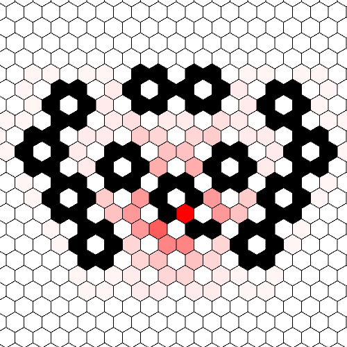

# Sylves Demos

[Sylves](https://boristhebrave.com/docs/sylves/1/) is an open source library for working with grids.

This repository contains a Unity project demonstrating how to use various features in a practical setting. They typically combine *multiple* features of Sylves to produce useful effects.

You can try it online at: https://boristhebrave.itch.io/sylves-demos

The following demos are included:

## CellPicker

This demo lets you edit the terrain on a planet surface. It's [inspired by](https://www.boristhebrave.com/2022/12/18/how-does-planet-work/) this [Planet game](https://oskarstalberg.com/game/planet/planet.html).

It demonstrates 

* Creating a [mesh grid](https://boristhebrave.com/docs/sylves/1/articles/grids/meshgrid.html) and [mesh prism grid](https://boristhebrave.com/docs/sylves/1/articles/grids/meshprismgrid.html) from a mesh.
* How to detect where the mouse is pointing in 3d space.
* How to do marching cubes (wang tile) style autotiling.
* How to use [deformations](https://boristhebrave.com/docs/sylves/1/articles/concepts/deformation.html) to warp tiles to fit an irregular grid.

### Controls

Use left/right click to change the terrain, and middle mouse to control the camera.

## Pathfinder

This demo lets you edit a tilemap with the mouse, and performs pathfinding on that map.

It demonstrates:

* Using the [transform modifier](https://boristhebrave.com/docs/sylves/1/articles/modifiers/transformmodifier.md) to turn a square grid into an isometric grid.
* How to interact between Sylves and Unity's tilemap system.
* How to detect where the mouse is pointing in 2d space.
* How to use [pathfinding](https://boristhebrave.com/docs/sylves/1/arcticles/concepts/pathfinding.html)

### Controls

Use left click to toggle a tile, and middle mouse to control the camera.

## Langton

This demo is an animated version of the [tutorial](https://boristhebrave.com/docs/sylves/1/tutorials/langton.html) showing how to implement [Langton's Ant](https://en.wikipedia.org/wiki/Langton's_ant).

### Controls

None

## Polyominoes

This demo shows about placing [compound pieces](https://en.wikipedia.org/wiki/Polyform), like you might see in a city builder game.

It demonstrates:

* How to use [grid symmetry](https://boristhebrave.com/docs/sylves/1/articles/concepts/grid_symmetry.html) to translate or rotate a shape on a grid.
* How to write code abstractly to support any grid.

### Controls

Left click to place a piece down. Right click to rotate. Middle mouse to control the camera.
